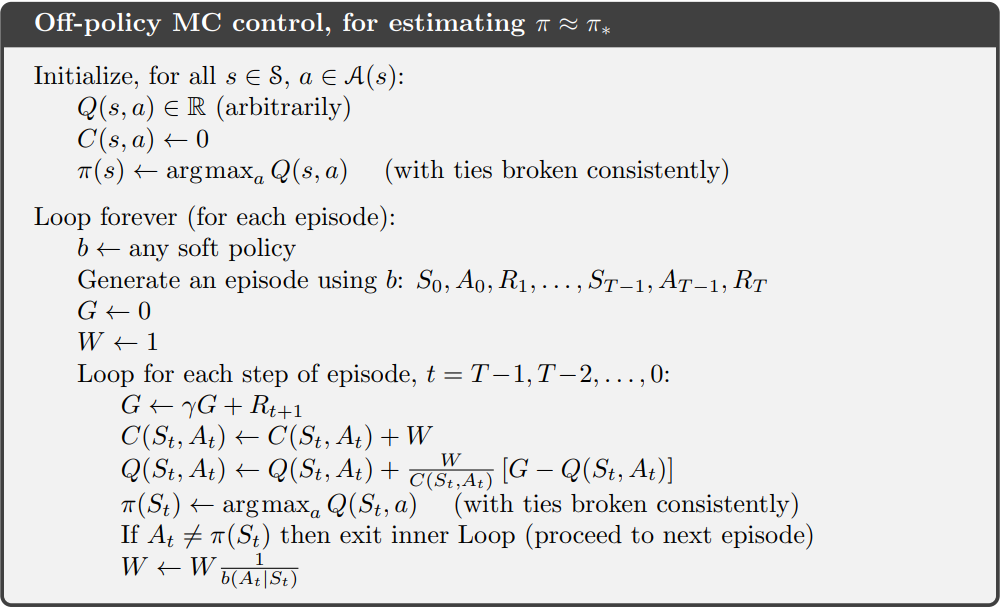

# Off Policy Monte Carlo

My implementation of the below does something... just not sure yet if there is a bug or if it really is just really sample inefficient.

Currently after 100,000 iterations it barely learns beyond the room with a goal inside, and even then sometimes it doesn't learn the right thing...

The algorithm is:  

