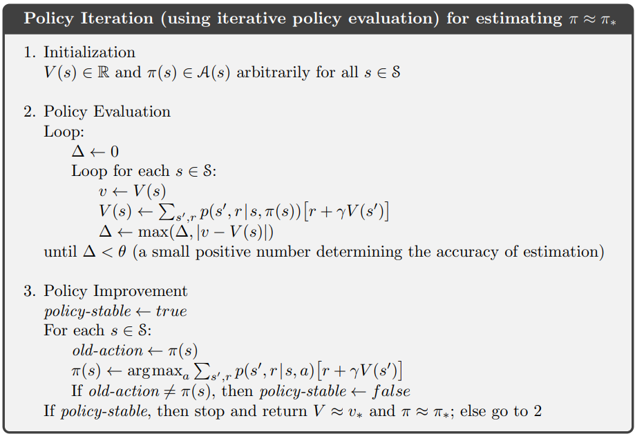

# Policy Iteration

Similarly to [Value Iteration](../Value_Iteration/README.md), If you find yourself in posession of a fully defined [Markov Decision Process](https://en.wikipedia.org/wiki/Markov_decision_process), then you can find the optimal values and the optimal policy in each state. However, now we begin with a policy, and improve the poliicyer iteratively as well as our values at each state. Since there are a finite number of policies, we have the MDP to evaluate how good other actions are not currently in our policy, and we either improve our policy or don't, we still converge to the optimal value function, and thus policy.

The algorithm is:

