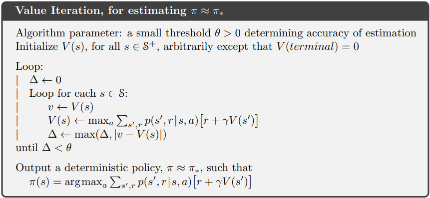

# Value Iteration

If you find yourself in posession of a fully defined [Markov Decision Process](https://en.wikipedia.org/wiki/Markov_decision_process), then you can use this algorithm to compute the unique optimal values of each state. From those optimal values you can derive a family of equivalently good greedy policies. These policies will provide one action to follow in each state so that you receive the optimal discounted sum of rewards for any episode you can possibly encounter following that state.

The algorithm is:

